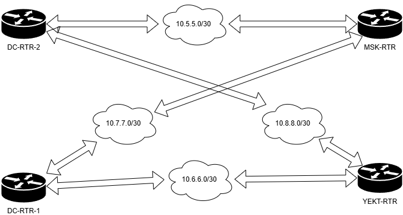

Вот готовые скрипты для настройки отказоустойчивых GRE-туннелей между роутерами по топологии:



Логи из всех скриптов можно убрать

### 1. Основные скрипты настройки туннелей

#### Для DC-RTR-1 (`/usr/local/bin/setup_tunnels_dc1.sh`):
Создать setup_tunnels_dc1.sh и добавить права на использование
` chmod +x /usr/local/bin/*.sh ` аналогично для остальных скриптов
```bash
#!/bin/bash

MAIL_SERVER="10.15.10.100" # IP почтового сервера
# ========================

# Настройка основного туннеля в Москву
ip tunnel add gre-msk mode gre remote 188.121.90.2 local 200.100.100.20 ttl 255
ip link set gre-msk up
ip addr add 10.7.7.1/30 dev gre-msk

# Настройка резервного туннеля в Екатеринбург
ip tunnel add gre-ekt mode gre remote 88.8.8.27 local 200.100.100.20 ttl 255
ip link set gre-ekt up
ip addr add 10.6.6.1/30 dev gre-ekt

# Настройка маршрутов по умолчанию (СПРОСИТЬ У МИШи НУЖНО ли это)
ip route replace 10.15.10.100 via ${MSK_TUN_IP%/*} dev gre-msk metric 100
ip route replace 10.15.10.100 via ${EKT_TUN_IP%/*} dev gre-ekt metric 200
```

#### Для DC-RTR-2 (`/usr/local/bin/setup_tunnels_dc2.sh`):
```bash
#!/bin/bash

MAIL_SERVER="10.15.10.100" # IP почтового сервера

# Настройка основного туннеля в Екатеринбург
ip tunnel add gre-ekt mode gre remote 88.8.8.27 local 100.200.100.20 ttl 255
ip link set gre-ekt up
ip addr add 10.8.8.1/30 dev gre-ekt

# Настройка резервного туннеля в Москву
ip tunnel add gre-msk mode gre remote 188.121.90.2 local 100.200.100.20 ttl 255
ip link set gre-msk up
ip addr add 10.5.5.1/30 dev gre-msk 

# Настройка маршрутов по умолчанию(СПРОСИТЬ У МИШи НУЖНО ли это)
ip route replace 10.15.10.100 via ${EKT_TUN_IP%/*} dev gre-ekt metric 100
ip route replace 10.15.10.100 via ${MSK_TUN_IP%/*} dev gre-msk metric 200
```

### 2. Скрипты мониторинга и failover

#### Для MSK-RTR (`/usr/local/bin/failover_msk.sh`):
```bash
#!/bin/bash

MAIN_GW="10.7.7.2"  # DC-RTR-1 туннель IP
BACKUP_GW="10.5.5.2" # DC-RTR-2 туннель IP
TEST_HOST="10.15.10.100"   # Почтовый сервер
CHECK_INTERVAL=10         # Интервал проверки в секундах

while true; do
    if ping -c 3 -I gre-dc1 $TEST_HOST &> /dev/null; then
        ip route replace default via $MAIN_GW dev gre-dc1
    else
        ip route replace default via $BACKUP_GW dev gre-dc2
    fi
    sleep $CHECK_INTERVAL
done
```

#### Для YEKT-RTR (`/usr/local/bin/failover_yekt.sh`):
```bash
#!/bin/bash

#Создание туннеля на rtr2
ip tunnel add gre-ekt mode gre remote 100.200.100.20 local 88.8.8.27 ttl 255
ip link set gre-dc2 up
ip addr add 10.8.8.2/30 dev gre-dc2


MAIN_GW="10.8.8.2"  # DC-RTR-2 туннель IP
BACKUP_GW="10.6.6.2" # DC-RTR-1 туннель IP
TEST_HOST="10.10.10.10"   # Почтовый сервер
CHECK_INTERVAL=10         # Интервал проверки в секундах

while true; do
    if ping -c 3 -I gre-dc2 $TEST_HOST &> /dev/null; then
        ip route replace default via $MAIN_GW dev gre-dc2
    else
        ip route replace default via $BACKUP_GW dev gre-dc1
    fi
    sleep $CHECK_INTERVAL
done
```


### 4. IPSec настройка (общий шаблон для всех узлов)

`/etc/ipsec.conf`:
```
config setup
    charondebug="all"
    uniqueids=yes

conn %default
    ikelifetime=60m
    keylife=20m
    rekeymargin=3m
    keyingtries=1
    keyexchange=ikev2
    ike=aes256-sha256-modp2048!
    esp=aes256-sha256!
    authby=secret

conn gre-tunnel
    left=%any
    leftid=@LOCAL_ID
    leftsubnet=0.0.0.0/0
    right=%any
    rightid=@REMOTE_ID
    rightsubnet=0.0.0.0/0
    auto=start
```

`/etc/ipsec.secrets`:
```
@LOCAL_ID @REMOTE_ID : PSK "your_shared_secret_key"
```