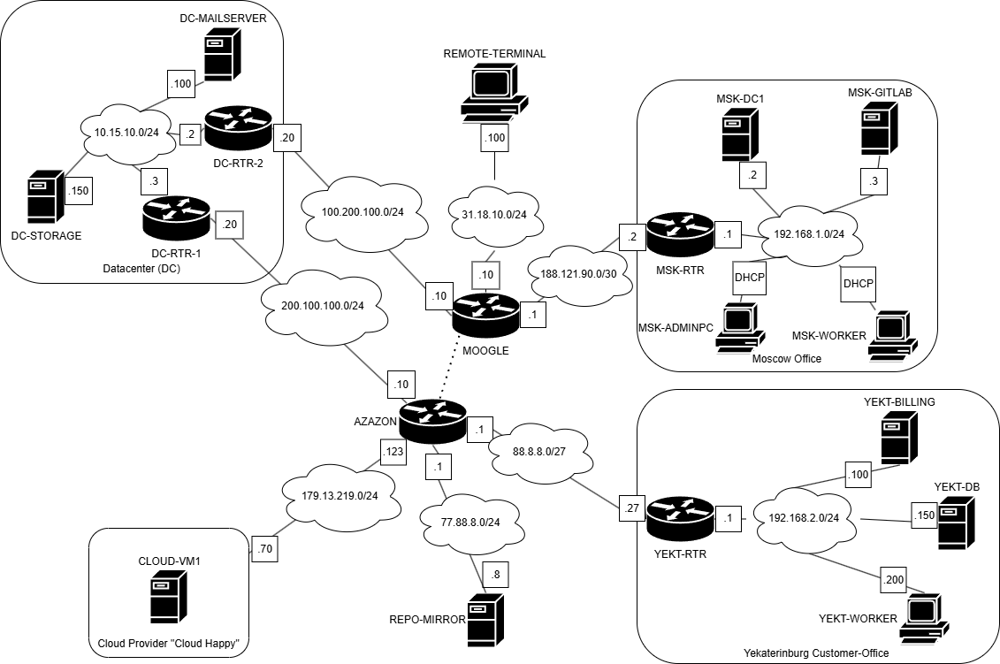

# Работы в ЦОД
## 1. Настроить L3 адреса на всех устр-вах

DC-MAILSERVER  	10.15.10.100

DC-STORAGE	10.15.10.150 

DC-RTR-2	10.15.10.2

DC-RTR-1    10.15.10.3

CLOUD-VM	 179.13.219.70

MSK-RTR	 192.168.1.0

MSK-DC	 192.168.1.2

MSK-ADMINPC	 DHCP

MSK-WORKER	 DHCP

MSK-GITLAB	 192.168.1.3

YEKT-RTR	 192.168.2.1

YEKT-BILLING    192.168.2.100

YEKT-DB     192.168.2.150

YEKT-WORKER     192.168.2.200

Вот таблица с данными, которые вы предоставили:

| Устройство       | IP-адрес        |
|------------------|-----------------|
| DC-MAILSERVER    | 10.15.10.100    |
| DC-STORAGE       | 10.15.10.150    |
| DC-RTR-2         | 10.15.10.2      |
| DC-RTR-1         | 10.15.10.3      |
| CLOUD-VM         | 179.13.219.70   |
| MSK-RTR          | 192.168.1.0     |
| MSK-DC           | 192.168.1.2     |
| MSK-ADMINPC      | DHCP            |
| MSK-WORKER       | DHCP            |
| MSK-GITLAB       | 192.168.1.3     |
| YEKT-RTR         | 192.168.2.1     |
| YEKT-BILLING     | 192.168.2.100   |
| YEKT-DB          | 192.168.2.150   |
| YEKT-WORKER      | 192.168.2.200   |

